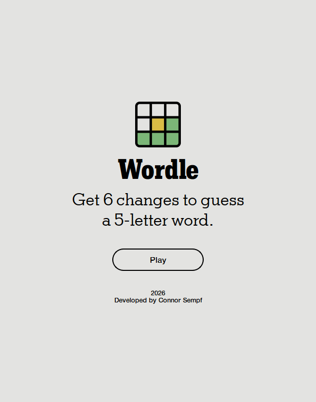
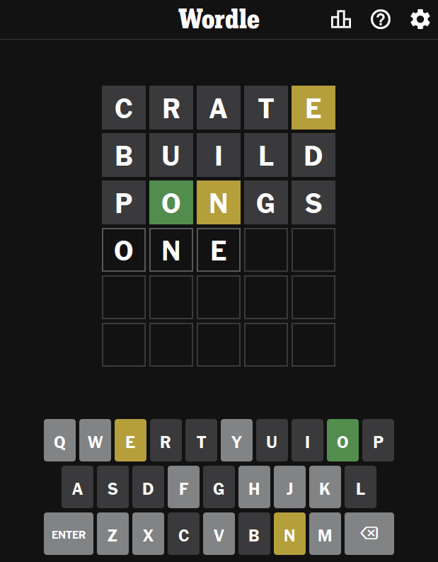
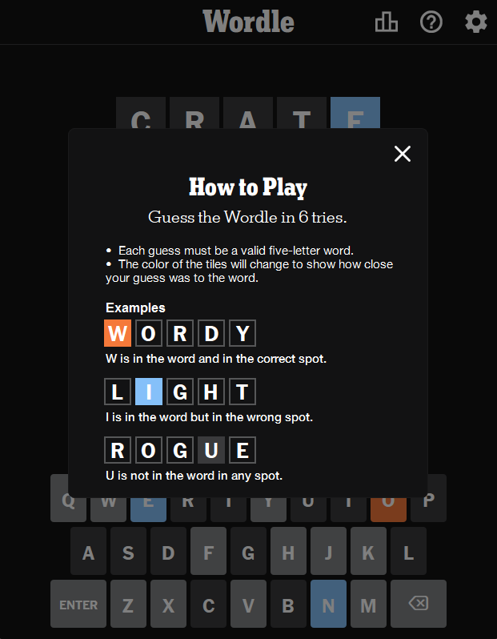
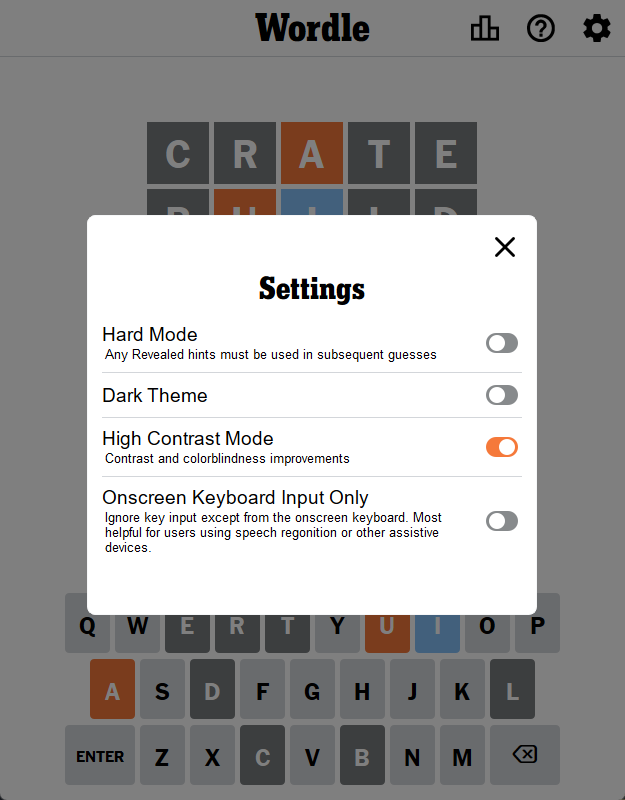

# Wordle #
**A word-guessing game desktop application as a clone for the popular New York Times game written with Qt6 and C++20.**


---
<br>
<br>


## 🧰 Installation From Release ##
Download any of the following releases that fit your platform. Extract and run the executable.
- **Windows:** ``
- **macOS:** ``
- **Linux:** ``


---
<br>
<br>


## 🚀 Features ##
- **🎨 Clean, Intuitive GUI:** Minimalist design focused on gameplay with responsive buttons, clear feedback, and smooth animations.
- **⏱️ Real-Time Game Feedback:** Instant visual feedback on letter matches, including color-coded tiles (green for correct position, yellow for wrong position, gray for not in word).
- **🧩 Sustained Player Statistics and Settings:** Save your game progress, win streak, and personal statistics. Customize difficulty levels and game preferences that persist between sessions.
- **🖼️ Responsive Window Layouts:** Adapts seamlessly to different window sizes and screen resolutions without breaking the user interface.
- **🛡️ Full Application Support:** Proper window icons, system tray integration, keyboard shortcuts, and native OS integration for a polished desktop experience.
- **🖥️ Cross-Platform Support (Windows, macOS, Linux):** Built with Qt6 to run natively on all major operating systems with consistent behavior.
- **📚 Fully Documented:** Well-commented source code, inline documentation, and developer guides for anyone wanting to contribute or modify the project.


---
<br>
<br>


## 🔥 Screenshots ##
<p align="left">
  
  
  
  
</p>


---
<br>
<br>


## 🛠️ Building From Source ##
### 🔹 Install Project Requirements ###
To build **Wordle** from source, install the following as they are all required.
- **Qt 6.10+** or higher development libraries.
- **C++ 20+** capabilities. Qt6 will come with the necessary compiler to build the project.
- **CMake 3.16+** for building the project.
- **Git** to clone the Wordle repository.
### 🔹 Install Qt Development Libraries ###
- **Windows:** Install Qt from [qt.io](https://www.qt.io/development/download)
- **macOS:**
    ```bash
    brew install qt6
    ```
- **Linux:**
    ```bash
    sudo apt install qt6-base-dev qt6-tools-dev cmake build-essential
    ```
### 🔹 Clone the Repository ###
```bash
cd /path/to/your/desired/directory
git clone https://github.com/connortsempf/wordle.git
cd wordle
```
### 🔹 Create the Build Directory ###
```bash
mkdir build
cd build
```
### 🔹 Build the Project Using CMake ###
```bash
## Configure the Build ##
cmake ..

## Only If The Qt Package isn't Visisble in the Path and Configuration Fails, Point to It Manually ##
cmake .. -DQT6_DIR="/path/to/your/Qt/package/6.10.x/compiler/"

## Generate the Application ##
cmake --build .
```
### 🔹 Run the Application ###
- The output binaries are generated in the `/bin` directory
- Find and run the executable from there


---
<br>
<br>


## 📄 License & Attribution ##
This is an unofficial fan recreation of Wordle. The original game concept is owned by the New York Times Company. This project is licensed under the MIT License - see the LICENSE file for details.

- Built with [Qt](https://www.qt.io/)
- Inspired by [Wordle](https://www.nytimes.com/games/wordle/index.html)
